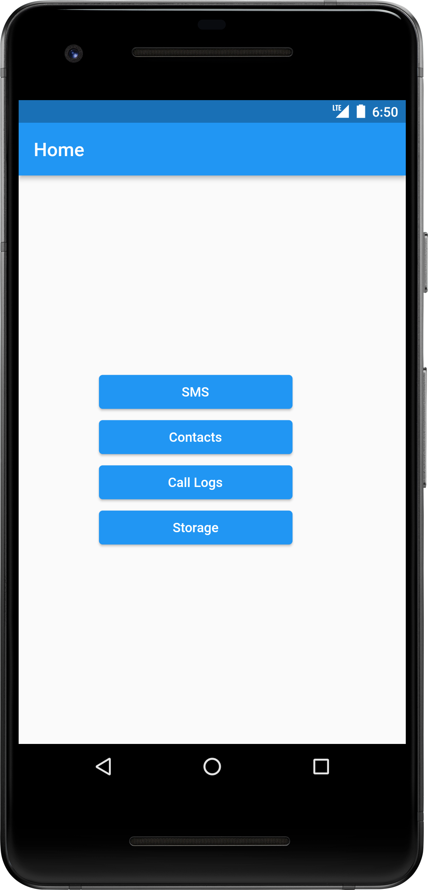

# Androclient

A Flutter based virus who theft Contact, SMS, Call logs, Photos, Videos and Phone information.

## Tech Stack

- ***Framework***: Flutter

- ***Language***: Dart

- ***Database***: Firebase

## Features

Click to see features

 

- [x] UI
  - [x] Material Design
  - [x] Status indicator of data uploading
  - [x] Live media count while uploading
  - [x] Separate buttons for SMS, Contact, Call Logs and Media
- [x] Functionality
  - [x] SMS support
  - [x] Contact support
  - [x] Call log support
  - [x] Photos/Videos support
  - [x] 2 version
    - [x] Safe version
    - [x] Evil version
      - [ ] Work in background
      - [ ] Triggred from server
      - [ ] Can be triggred from server
      - [ ] Auto spawn it self

## Screenshot

Click to see screenshots

 

## Available on

## License

androclient is distributed under the MIT Licence, See [Licence](LICENCE).